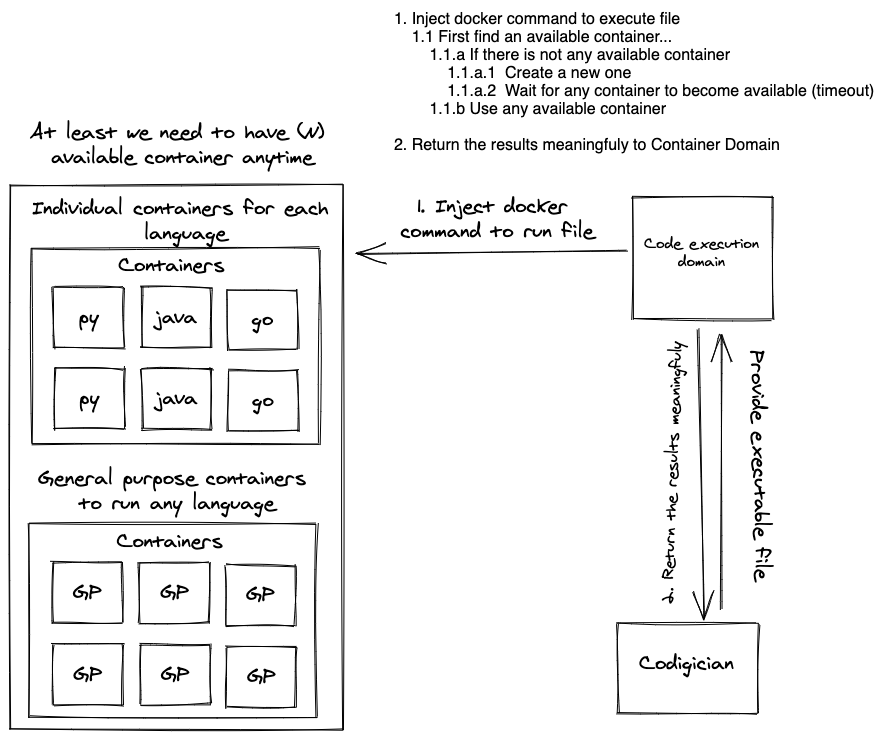

# codigician-api

# Question Code Testing

There is no need to have code templates. We can directly use expectation outputs and inputs. Client will write the
solution code. We run the code with some inputs and if the output is what we expected then that means the test is
passed. While we run these commands we need to have that information as a json or we will have it like an array. Also
the runtime is important for benchmark.

# Container Structure Design

# Priority

1. Remote code execution
2. Question bank (Editorial) (Unit tests, benchmark tests)
3. Auth, User (Score, Progress)
4. Discussion
5. Tutorial
